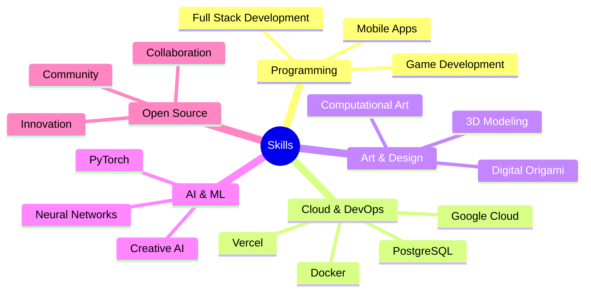

<div align="center">

# 🚀 Asaad | Developer & Digital Artist 🎨

[Portfolio](https://asaadzx.is-a.dev) • [Twitter](https://x.com/Asaad123TY) • [Email](mailto:asaad.work2010@gmail.com)

> _"Where Code Meets Creativity"_

</div>

<div align="center">

### 🎭 Full Stack Developer • Digital Artist • DevOps Engineer • AI Explorer • Origami Enthusiast

</div>

---

## 👋 Hello World!

Hey there! I'm Asaad, a 14-year-old developer and digital artist passionate about merging technology with creativity. I craft digital experiences that blend the precision of code with the beauty of art.

```python
class Asaad:
    def __init__(self):
        self.name = "Asaad"
        self.role = "Full Stack Developer"
        self.language_spoken = ["ar_SA", "en_US"]
        self.interests = [
            "Open Source Development",
            "3D Digital Art",
            "Machine Learning",
            "Origami Design",
            "Cross-platform Apps",
            "Cloud Architecture"
        ]
        self.cloud_stack = {
            "platforms": ["Google Cloud", "Vercel"],
            "databases": ["PostgreSQL", "MySQL"],
            "deployment": ["CI/CD", "Docker", "Cloud Run"]
        }

    def say_hi(self):
        print("Thanks for dropping by! Let's create something amazing together!")

me = Asaad()
me.say_hi()
```

## 🎨 Creative Tech Stack

<div align="center">

| Development | Creative | DevOps & Cloud | Tools & Platforms |
|-------------|----------|----------------|------------------|
| Python 🐍 | Blender 3D | Google Cloud ☁️ | Linux |
| Flutter 📱 | Three.js | Vercel ▲ | VS Code |
| C++ ⚡ | Godot Engine | PostgreSQL 🐘 | Git |
| JavaScript 🌐 | PyTorch | Docker 🐋 | MySQL |
| HTML/CSS 🎨 | Fresh | Cloud Run 🚀 | Android |
| Deno 🦕 | Computational Art | CI/CD 🔄 | GitHub |

</div>

## 🌟 Current Focus

- 🤖 Building AI-powered applications
- ☁️ Cloud-native application development
- 🎮 Game development with Godot
- 📐 Digital origami and 3D art creation
- 🌐 Contributing to open-source projects
- 📱 Cross-platform mobile development
- 🛠️ DevOps automation and optimization

## 📊 GitHub Analytics

<div align="center">

[](https://github.com/asaadzx)

[](https://github.com/asaadzx)

</div>

## 🎯 Featured Projects

<div align="center">

[](https://github.com/asaadzx/Chemical-Goose-reaction)
[](https://github.com/asaadzx/Grok-Linux-APP)
[](https://github.com/GhostFreakOS/Zenshell)
[](https://github.com/asaadzx/Anas-bn-malek-School)

[🔍 Explore More Projects](https://github.com/asaadzx?tab=repositories)

</div>

## 🎨 Art Meets Technology

I believe in the powerful intersection of art and technology. My background in origami and 3D art brings unique perspectives to software development:

- **Geometric Thinking**: Applying spatial reasoning to solve complex problems
- **Pattern Recognition**: Finding elegant solutions through creative patterns
- **Detail-Oriented**: Bringing precision from paper folding to code
- **Creative Problem-Solving**: Using artistic thinking in technical challenges

## 🌱 Growth Areas



## 💻 Infrastructure & DevOps

```yaml
Cloud Services:
  Google Cloud:
    - Cloud Run
    - Cloud Storage
    - Cloud SQL
  Vercel:
    - Edge Functions
    - Serverless Deployment
    - Analytics

Databases:
  PostgreSQL:
    - Performance Optimization
    - Data Modeling
    - High Availability

CI/CD:
  - Automated Testing
  - Continuous Deployment
  - Infrastructure as Code
```

## 📫 Let's Connect!

- 💼 Open for collaboration on creative tech projects
- 🎨 Looking to merge art with technology
- ☁️ Passionate about cloud architecture and DevOps
- 🤝 Always excited to meet fellow developers and artists

<div align="center">

---

[](https://github.com/asaadzx)

_Last Updated: 2025-07-04_

</div>
