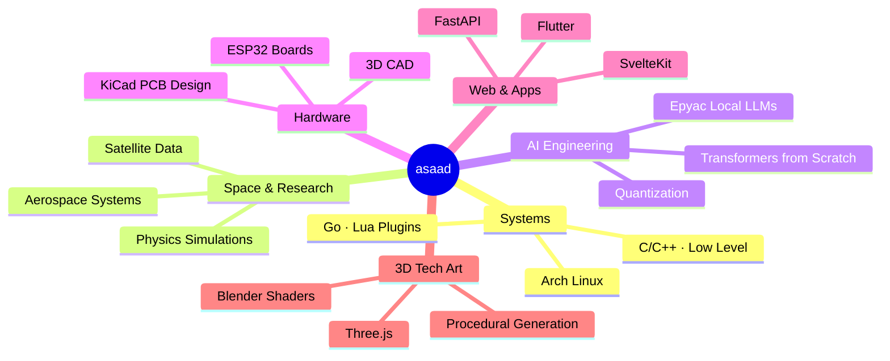

<div align="center">


</div>

<div align="center">


[](https://asaadzx.is-a.dev)
[](mailto:asaad.work2010@gmail.com)
[](https://www.linkedin.com/in/asaad-zx/)
[](https://buymeacoffee.com/asaadzx)

> _"Making the incredibly complex look simple. (Which is incredibly complicated.)"_

</div>


## `$ whoami` 

```console
asaad@github:~$ whoami
Asaad Zein · 16 · Cairo, Egypt

asaad@github:~$ cat mission.txt
Self-taught engineer targeting the Egyptian Japanese Kosen track.
Building efficient software for constrained hardware — and learning
the physics behind everything I ship.

asaad@github:~$ ls interests/
aerospace-systems/  local-ai-inference/  embedded-hardware/
procedural-shaders/  research/
```


<br clear="right" />

---

## `[ SYSTEM_MAP ]`

<div align="center">


```mermaid
mindmap
  root((asaad))
    Systems
      Go · Lua Plugins
      C/C++ · Low Level
      Arch Linux
    Space & Research
      Aerospace Systems
      Satellite Data
      Physics Simulations
    AI Engineering
      Epyac Local LLMs
      Transformers from Scratch
      Quantization
    Hardware
      ESP32 Boards
      KiCad PCB Design
      3D CAD
    Web & Apps
      SvelteKit
      FastAPI
      Flutter
    3D Tech Art
      Blender Shaders
      Procedural Generation
      Three.js
```

</div>

---

## `[ MISSION_LOG ]` 

| ID | OPERATION | STATUS |
|----|-----------|--------|
| `BAKLAVA` | **[BaklavaShell](https://github.com/asaadzx/BaklavaShell)** — Go shell with a Lua plugin framework, ~3MB static binary | `ACTIVE` |
| `EPYAC` | **[Epyac AI](https://github.com/asaadzx/Epyac_AI)** — quantized local LLM stack engineered to run on low-spec student hardware | `ACTIVE` |
| `GEOGEMMA` | **[geospatial_Gemma3-4B](https://github.com/asaadzx/geospatial_Gemma3-4B)** — Gemma3 4B fine-tuned for astrophysics data & Q&A | `SHIPPED` |
| `SPACE-APPS` | **[Data-Wizards-Backend](https://github.com/asaadzx/Data-Wizards-Backend)** — NASA Space Apps · satellite air-quality prediction on FastAPI, led a 5-dev team | `DEPLOYED` |

---

## `// TOOLKIT`

<div align="center">

| Languages | Web & Apps | 3D & Hardware | Systems |
|-----------|------------|---------------|---------|
| Python · C/C++ · Go · TypeScript · Lua · Dart | SvelteKit · React · FastAPI · Flutter · Tailwind | Blender · Three.js · KiCad · ESP32 | Arch Linux · Docker · PostgreSQL · Zed |

</div>

---

## `[ TELEMETRY ]`

<div align="center">


<br />


</div>

---

## `// RESEARCH_NOTES` 

- [**The DNA of Embedded Systems**](https://asaadzx.is-a.dev/blog/embedded-systems-dna/) — how embedded architectures actually work
- [**Security Geeks: Ethical Hacking**](https://asaadzx.is-a.dev/blog/security-geeks-presentation/) — offensive security fundamentals
- [**The Modern Developer's AI Workspace**](https://asaadzx.is-a.dev/blog/ai-workspace-guide/) — building a terminal-driven AI dev environment

---

<div align="center">

---


[](mailto:asaad.work2010@gmail.com)
[](https://www.linkedin.com/in/asaad-zx/)
[](https://x.com/Asaad123TY)
[](https://www.instagram.com/asaad.zein.1/)

[](https://github.com/asaadzx)

_Last Updated: 2026-08-21_

</div>
